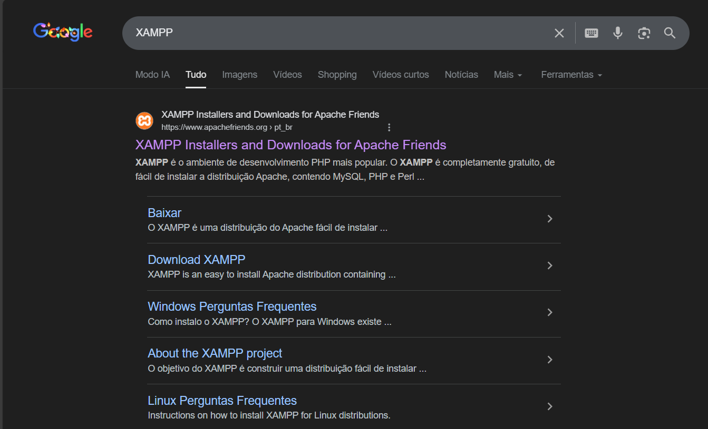
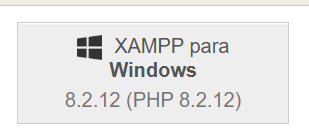
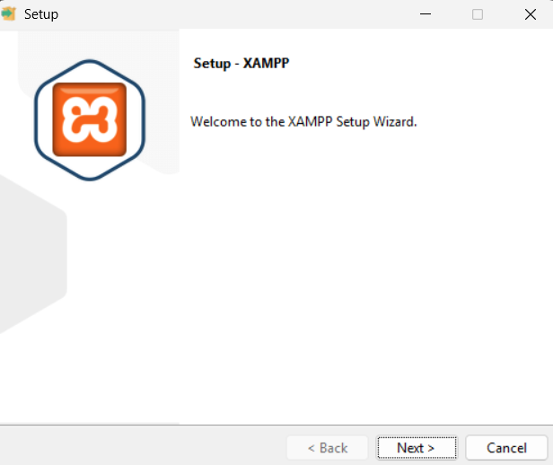
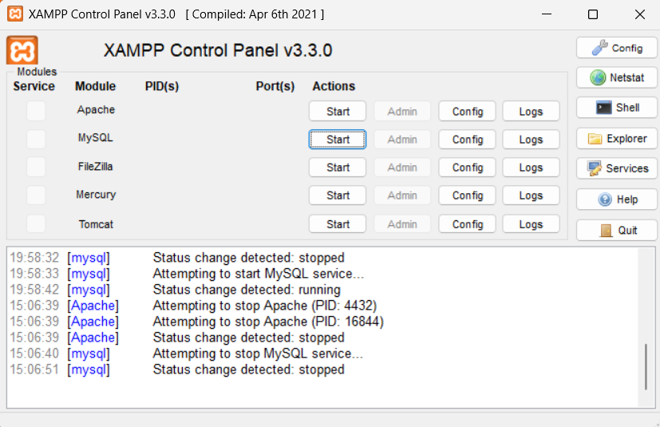
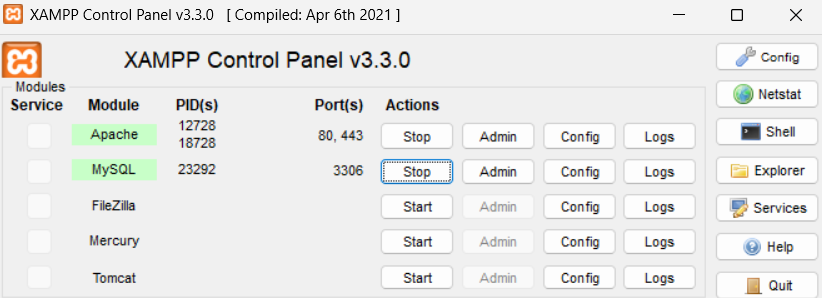
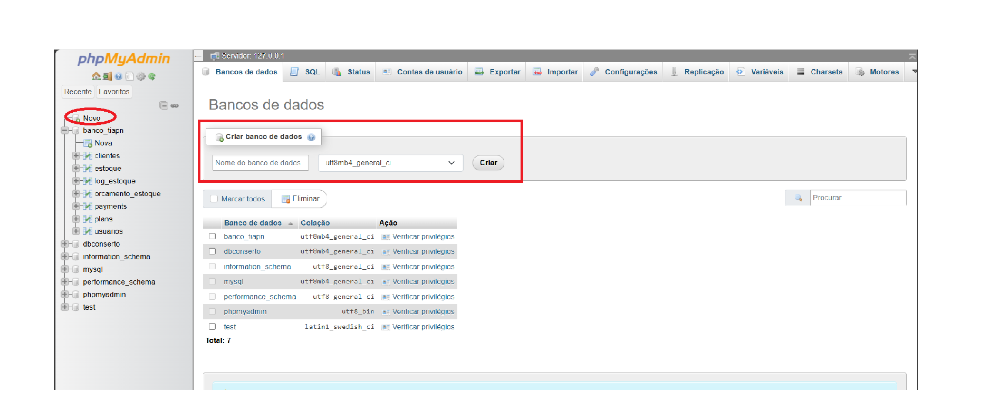
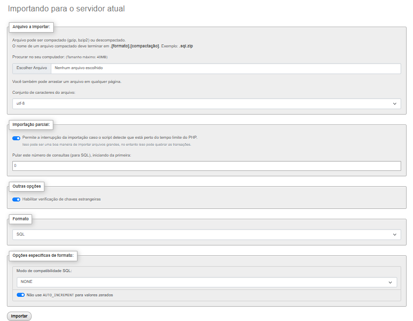

# Estoque Ideal

`Analise e Desenvolvimento de sistemas`

`Trabalho Interdisciplinar: Aplicações para Processos de Negócios`

`2º Semestre`

## Integrantes

* Arthur Nunes
* Carlos Eduardo
* Bernardo Morreira
* Danton Lucas
* Erick Ryan
* Lucas Ramos
* Marcus Andrade

## Orientador

* Gleisson Albergaria Amaral

# 📦 Sistema de Controle de Estoque e Orçamentos
Projeto de gerenciamento de estoque com funçoes de geração de estoque,controle do fluxo dos clientes e visualização de relatorios.
Esse projeto foi desenvolvido para fins academicos
Esta aplicação PHP foi organizada para rodar localmente com XAMPP e usa MySQL via `mysqli`. O repositório inclui integrações com `PHPMailer` e `Stripe` (via `vendor/`).

---

## 🚀 Funcionalidades Principais
-Gerenciamento de produtos no estoque
-Cadastro e geração de clientes
-Cadastro e geração de usuarios 
-Criação de gestão de orçamento
-Processamento de pagamentos 
-Relatorios (vendas, clientes, estoque)

---

**Tecnologias**
- PHP 8.2.12
- MySQL 
- Composer (dependências em `vendor/`)
- Frontend com HTML/CSS/JS e Bootstrap


**Requisitos**
- Windows (testado com XAMPP)
- XAMPP (Apache + MySQL)
- Composer

---

**Instalação (XAMPP)**
1.Em seu navegador busque por XAMPP e acesse o primeiro link


2.Clique em baixar XAMPP para o Windows


3.Extraia o arquivo e de proximo em tudo


4.O XAMMP estra pronto para uso


---

**Instalação (rápida)**
1. Copie a pasta do projeto para `C:\xampp\htdocs\TIAPN-Estoque-PUC`.
2. Inicie o Apache e o MySQL pelo painel do XAMPP.

3. Importe o banco de dados pelo phpMyAdmin:
	- Abra `http://localhost/phpmyadmin`
	- Crie um banco de dados (ex.: `banco_tiapn`) ou importe diretamente
    
	- Importe o arquivo SQL em `banco/` ( `banco_tiapn.sql`)
    
4.(Opcional) Se precisar instalar dependências do Composer,strip e phpmiler:

```powershell
cd C:\xampp\htdocs\TIAPN-Estoque-PUC
composer install

cd C:\xampp\htdocs\TIAPN-Estoque-PUC
composer require phpmailer/phpmailer

cd C:\xampp\htdocs\TIAPN-Estoque-PUC
composer require stripe/stripe
```

---

**Executando localmente**
- Abra no navegador: `http://localhost/TIAPN-Estoque-PUC/index.php` 
- Para login/usuários, use a interface em `pages/login.php` (se existir) e/ou crie um usuário via banco de dados.

---

**Configurações adicionais**
- E-mail: a integração com envio de e-mails utiliza `PHPMailer` disponível em `vendor/phpmailer` — ajuste credenciais e SMTP nas partes do código que chamam o PHPMailer.
- Pagamentos: integrações com Stripe estão em `vendor/stripe` e pontos no código relacionados a `processar_pagamento.php`.

---
**👨‍💻Autores**
Danton Lucas
GitHub:https://github.com/DantonLRR
Linkedin:https://www.linkedin.com/in/dantonlucas/

Lucas Ramos
GitHub:https://github.com/LucasAMRamos
Linkedin:

Marcus Andrade
GitHub:https://github.com/Marcuszki
Linkedin:https://www.linkedin.com/in/marcus-vacosta/


